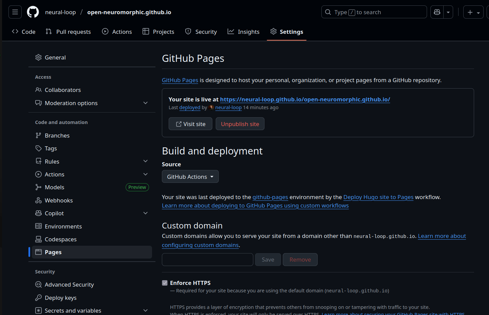

# Contributor Guide: Setting Up a Staging Environment

To facilitate review and testing of new features before they are merged into the main project, contributors can set up their own staging environment using a personal fork and a `staging` branch. This guide outlines the recommended workflow.

## Staging Workflow

The process involves using a dedicated `staging` branch on your personal fork of the repository. Pushing to this branch will trigger a GitHub Action that builds and deploys a preview of the site to your personal GitHub Pages.

### Step-by-Step Instructions

#### Step 1: Enable GitHub Pages on Your Fork (One-Time Setup)

Before your fork can deploy a staging site, you must enable GitHub Pages and set the build source to GitHub Actions. You only need to do this once per fork.

1.  Navigate to your forked repository on GitHub.
2.  Go to the **Settings** tab.
3.  In the left sidebar, click on **Pages**.
4.  Under the **Build and deployment** section, select **GitHub Actions** from the **Source** dropdown menu. The configuration will be handled automatically by the workflow file in the repository.




#### Step 2: Create a Local `staging` Branch

If you don't already have one, create a local `staging` branch. It's best to base this off the latest version of the main repository's `main` branch.

```bash
# Ensure your local `main` is up-to-date with the upstream repository
git checkout main
git pull upstream main

# Create and switch to a new staging branch
git checkout -b staging
```

#### Step 3: Merge Your Feature Branches

Merge any feature branches you are working on into your local `staging` branch.

```bash
git merge your-feature-branch-1
git merge your-feature-branch-2
```

#### Step 4: Push to Your Fork

Push the `staging` branch to your personal fork on GitHub (referred to as `origin`).

```bash
git push origin staging
```

#### Step 5: View Your Staging Site

Pushing to the `staging` branch triggers the `Deploy Hugo site to Pages` GitHub Action. Once the action completes, your staging site will be live. You can find the URL in your fork's repository settings on the same **Settings > Pages** screen you configured in Step 1.

## Handling the `PAT_FOR_ISSUES` Secret

Our GitHub Actions workflow includes a step to automatically update the "Mission Board" by fetching open issues from project repositories. This step requires a secret key called `PAT_FOR_ISSUES` (a Personal Access Token).

Since forks do not have this secret, the **"Update Mission Board" step will fail, causing the entire build to stop.** This will prevent your staging site from deploying.

**To fix this**, you can simply tell the workflow to continue even if this specific step fails. Add `continue-on-error: true` to the "Update Mission Board" step in the `.github/workflows/main.yml` file within your `staging` branch.

```yaml
      - name: Update Mission Board
        env:
          PAT_FOR_ISSUES: ${{ secrets.PAT_FOR_ISSUES }}
        run: npm run update-mission-board
        continue-on-error: true # Add this line
```

This change ensures that a failure in fetching issues won't block the deployment of your staging site. The Mission Board page on your preview site may not have the latest issues, but the rest of the site will build and deploy correctly.

## Resetting Your Staging Branch

Sometimes, you may need to start fresh with a new staging environment.

1.  **Delete the Remote `staging` Branch:**
    ```bash
    git push origin --delete staging
    ```

2.  **Recreate the Branch Locally:**
    ```bash
    git branch -D staging
    git fetch upstream
    git checkout -b staging upstream/main
    ```

3.  **Merge New Features and Push:**
    You can now merge your new feature branches and push to your fork. A `force push` might be necessary if you are overwriting an existing branch with a different history.
    ```bash
    git push origin staging --force
    ```

## A Note on URL Path Issues in Staging

A known issue with GitHub Pages deployments for forks is that the site is served from a subdirectory (e.g., `/<repository-name>/`). Our GitHub Actions workflow automatically sets the `baseURL` in Hugo to account for this.

However, you may encounter an issue where links incorrectly point to the root of your GitHub Pages domain instead of the subdirectory.

*   **Incorrect Link:** `https://<username>.github.io/blog/my-post/`
*   **Correct Link:** `https://<username>.github.io/open-neuromorphic.github.io/blog/my-post/`

This problem occurs when internal links are hardcoded or use methods that don't respect Hugo's `baseURL`.

### The Solution

To ensure links work correctly in both production and staging environments, always use Hugo's built-in `site.GetPage` and `.RelPermalink` methods for creating internal links. Avoid hardcoded paths.

**Robust Method (Recommended):**
```go-html-template
{{ $page := site.GetPage "path/to/page"; $page.RelPermalink }}
```

**Fragile Method (Avoid):**
```go-html-template
{{ "/path/to/page/" | relLangURL }}
```

Following this best practice is the most elegant and reliable solution to prevent broken links in staging environments. For more context, you can refer to the [related GitHub issue](https://github.com/open-neuromorphic/open-neuromorphic.github.io/issues/332).
