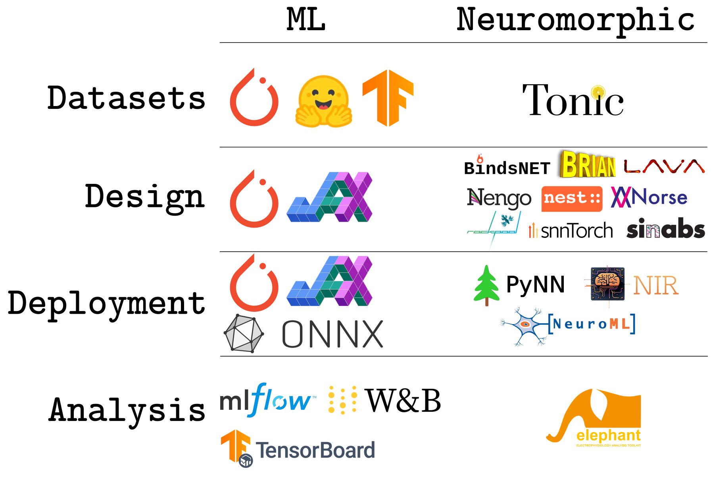

**TL;DR:** Neuromorphic computing has incredible potential, but our development workflow is far behind conventional machine learning. While ML researchers can go from idea to deployment in days, neuromorphic researchers often spend months just getting their algorithms running on hardware. This infrastructure gap isn't just frustrating—it's fundamentally limiting the field's progress. We need to unite around the tools, standards, and ecosystem that will unleash neuromorphic computing's true potential.

---

## The Two-Week Reality Check

Imagine you have a breakthrough idea for a neuromorphic vision algorithm. Your brain is buzzing with possibilities—you've identified a novel approach to temporal processing that could revolutionize edge computing.

In conventional machine learning, your journey would look similar to this:
- **Day 1:** Prototype in PyTorch, leverage existing datasets
- **Day 3:** Train on standardized benchmarks, compare with baselines
- **Day 5:** Deploy to cloud infrastructure, scale testing
- **Day 7:** Share reproducible results with the community

In neuromorphic computing, your journey looks more like this:
- **Day 1:** Hunt for hardware-specific documentation
- **Day 10:** Still struggling with vendor-specific toolchains
- **Day 28:** Re-implement algorithm from scratch to accommodate hardware interface
- **Day 32:** Debug toolchain-specific edge cases
- **Day 50:** Debug hardware-specific edge cases
- **Day 100-300:** Finish and hope someone else can reproduce your results

This isn't just frustrating—it's [a fundamental barrier to scientific progress](/blog/strategic-vision-open-neuromorphic/). While ML researchers iterate rapidly and build on each other's work, neuromorphic researchers often reinvent the wheel, working in isolation with incompatible tools.

We're trying to build rockets with stone tools while watching SpaceX launch daily. The hardware exists, the algorithms work, but we're trapped in an infrastructure stone age.

## The Tale of Two Workflows

The contrast between these development paths reveals the massive infrastructure gap holding back neuromorphic computing:

### Conventional ML: The Mature Ecosystem
- **Frameworks:** PyTorch, TensorFlow, JAX—choose your flavor
- **Datasets:** CIFAR, ImageNet, GLUE—standardized benchmarks everywhere
- **Hardware:** CUDA, TPUs, cloud instances—unified APIs across platforms
- **Deployment:** Docker, Kubernetes, serverless—production-ready pipelines
- **Community:** Kaggle, Papers with Code, Hugging Face—sharing is seamless

### Neuromorphic Computing: The Fragmented Landscape
- **Frameworks:** Intel's Lava, BrainScaleS PyNN, custom implementations
- **Datasets:** DVS128, N-MNIST, custom conversions—limited and inconsistent
- **Hardware:** Loihi, SpiNNaker, BrainScaleS—each with unique interfaces
- **Deployment:** Research prototypes, manual processes, vendor lock-in
- **Community:** Scattered papers, non-reproducible results, isolated toolchains

The numbers tell the story: A CNN implementation that takes 10 minutes in PyTorch can take 2 weeks to port to neuromorphic hardware. A benchmark that runs across dozens of ML frameworks might work on exactly one neuromorphic platform.

## Root Causes: Why We're Stuck

This isn't just technical debt—it's career death. PhD students abandon promising research directions because they can't get basic tools working. Postdocs watch their ideas gather dust while they wrestle with incompatible APIs. Industry researchers give up on neuromorphic solutions and return to conventional ML because deadlines don't wait for toolchain debugging.

The neuromorphic landscape is a patchwork of specialized tools: BindsNET, Brian, Lava, Nengo, Nest, Norse, SNNTorch, and SiMLabs—each with different APIs, philosophies, and capabilities. That diversity is not coincidental. The tools provide different neuron models with varying degrees of biological realism for many heterogeneous hardware accelerators. Diversity is necessary because there is no clear definition of neuromorphic neurons and there are many hardware platforms with different implementation details.

We recently hosted a talk on [open neuromorphic research infrastructure](https://open-neuromorphic.org/workshops/open-source-neuromorphic-infrastructure/) where we discussed exactly what the problems were and what we can do. We highlighted some problems that mirror the diagram above:

### 1. Lack of datasets and benchmarks
ML researchers enjoy rich, standardized datasets and benchmarks based on mature tooling. Neuromorphic computing relies on a single primary dataset source (Tonic) with limited standardization. This creates a chicken-and-egg problem: without diverse, accessible datasets, it's hard to develop robust algorithms, and without robust algorithms, there's less incentive to create comprehensive datasets. What's worse, many of the datasets consist of dense floating point data—not neuromorphic at all!

### 2. Tool Fragmentation
Each tool in the neuromorphic ecosystem has its own community, documentation style, and learning curve. Unlike ML's shared knowledge base and programming models, neuromorphic researchers must master multiple distinct toolchains, making collaboration difficult and slowing knowledge transfer.

### 3. Deployment Complexity
ML deployment has matured into standardized workflows using common platforms and APIs. Neuromorphic deployment relies on emerging standards like PyNN and NIR, alongside specialized tools like NeuroML. While promising, these tools haven't yet achieved the seamless integration that makes ML deployment trivial.

### 4. Analysis Tool Shortage
ML analysis benefits from mature, interconnected tools—MLflow for experiment tracking, Weights & Biases for visualization, TensorBoard for monitoring. Neuromorphic computing has fewer specialized analysis tools, with researchers often relying on general-purpose solutions that don't capture the unique characteristics of spiking neural networks.

### 5. Lack of commercial benefits
The inside joke in the field is that there is no "neuromorphic killer app". Companies are only now starting to make a commercially viable neuromorphic niche. Theoretically, there are massive benefits to be gained, but we still have to provide a convincing demonstration that beats traditional ML pipelines.

## The Vision: A Unified Neuromorphic Workflow

But here's the exciting part: now that we understand the problems, we can work on tangible solutions. The neuromorphic field is still young enough that we can architect the infrastructure we need.

### 1. Standardized Benchmarks
Rather than static and frame-based datasets like MNIST, we need a comprehensive suite of neuromorphic benchmarks that are temporal in nature. And instead of just comparing performance, we should include crucial metrics like resource/energy usage, inference time, and generalization capacity.

### 2. Community-Driven Tooling and Standards
Most tools are already open-source—including frameworks developed by private companies. But we need more than that: the integrations and standards governing the interplay between libraries and platforms need to be open and community-led to reduce the fragmentation and lower the barrier-to-entry.

### 3. Hardware-Agnostic Development
Imagine a workflow where we can directly take a model and port it to a neuromorphic device, similar to PyTorch's `.to(device)`.
This works because the hardware vendors bought into the infrastructure and implemented the drivers that realize this mapping.

### 4. Reproducible Research
When developments become hardware-agnostic, it's straightforward to require that scientific papers provide both data and code. No more "contact authors for code".

## The Path Forward: What We're Building

This isn't just a dream—it's a roadmap. As a community, Open Neuromorphic is uniquely positioned to push for solutions. We have over 2000 members of extremely knowledgeable and dedicated people who have proven track records of open-source contributions. By putting in the work to properly analyze the issues we can come together to build solutions that work for all of us. A positive prisoner's dilemma if you will. Researchers waste less time reinventing the wheel. Companies save time building new technologies. Investors get higher margins. Everybody wins.

This isn't just talk. We have been *hard* at work behind the scenes to gather the bright minds of the community. The next post will reveal what that entails exactly. 

**The transformation starts with you.** Every researcher who adopts [NIR](https://open-neuromorphic.org/neuromorphic-computing/software/data-tools/neuromorphic-intermediate-representation/), every company that opens their APIs, every developer who contributes a tool—each action breaks down the barriers that have held us back.

**Researchers:** Use open standards like [NIR](https://open-neuromorphic.org/neuromorphic-computing/software/data-tools/neuromorphic-intermediate-representation/), share your code and datasets, build on others' work instead of starting from scratch.

**Industry:** Implement community standards in your hardware tools, provide APIs that work with existing frameworks, invest in the ecosystem that benefits everyone.

**Developers:** Join the conversation on [Discord](https://discord.gg/hUygPUdD8E), contribute tools that fill the gaps, help others discover what's possible.

The infrastructure we need won't build itself. But together, we can create the foundation that will accelerate neuromorphic computing for the next decade.

## The Moment of Opportunity

We're at a unique moment in neuromorphic computing's history. The field is mature enough to recognize these infrastructure challenges but young enough that we can still architect elegant solutions. The hardware is becoming practical, the algorithms are proving their worth, and the community is ready to collaborate.

The question isn't whether we'll build this infrastructure—it's whether we'll build it together, creating an open ecosystem that accelerates everyone's research, or whether we'll remain fragmented, each group struggling with the same fundamental problems.

The conventional ML community didn't achieve its current momentum by accident. They built the tools, standards, and ecosystem that made rapid innovation possible. Now it's our turn.

The future of neuromorphic computing isn't just about better algorithms or faster hardware—it's about creating the infrastructure that will let a thousand innovations bloom. That infrastructure starts with us, today.

---

What would help *you* build better neuromorphic technologies? Do you agree or disagree with the points in this post? Join the conversation on [Discord](https://discord.gg/hUygPUdD8E), contribute on [GitHub](https://github.com/open-neuromorphic), or connect with us on [LinkedIn](https://www.linkedin.com/company/open-neuromorphic). Together, we can transform how neuromorphic research gets done.

*This is the second post in our strategic vision series. Read the [first post](https://open-neuromorphic.org/blog/strategic-vision-open-neuromorphic/) on our foundational vision for open neuromorphic computing.*

### Additional reading

1. [Kudithipudi, D. et al. Neuromorphic computing at scale. Nature 637, 801–812 (2025)](https://www.nature.com/articles/s41586-024-08253-8).
2. [Muir, D. R. & Sheik, S. The road to commercial success for neuromorphic technologies. Nat Commun 16, 3586 (2025)](https://www.nature.com/articles/s41467-025-57352-1).
3. [Schuman, C. D. et al. Opportunities for neuromorphic computing algorithms and applications. Nat Comput Sci 2, 10–19 (2022)](https://www.nature.com/articles/s43588-021-00184-y).
4. [Pedersen, J. E. et al. Neuromorphic intermediate representation: A unified instruction set for interoperable brain-inspired computing. Nat Commun 15, 8122 (2024)](https://www.nature.com/articles/s41467-024-52259-9).
