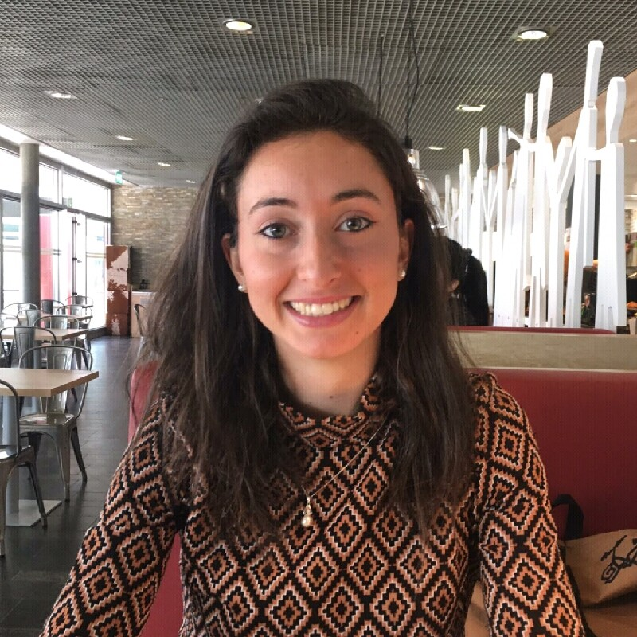
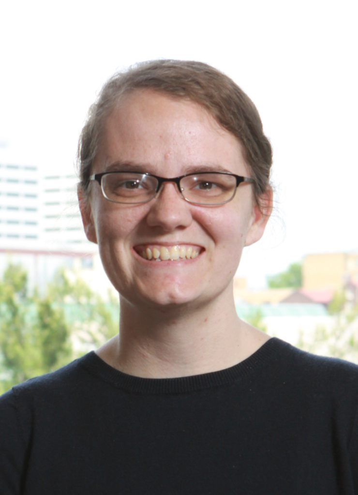

## 2022-12-13: First Edition of ONM

On the 13th of December 2022, the first edition of Open Neuromorphic took place! The invited speakers were:
- [Charlotte Frenkel](https://chfrenkel.github.io) ([slides](/onm-events/event-22-12-13/slides/charlotte-frenkel.pdf)).
- [Gregor Lenz](https://lenzgregor.com) ([slides](https://slides.com/gregorlenz/open-neuromorphic)).
- [Jason Eshraghian](https://jasoneshraghian.com).
- [Melika Payvand](https://services.ini.uzh.ch/people/melika).
- [Jens Egholm Pedersen](https://jepedersen.dk) ([slides](https://jepedersen.dk/slides/2212_ONM/index.html)).

Host: [Fabrizio Ottati](https://fabrizio-ottati.github.io) ([slides](/onm-events/event-22-12-13/slides/fabrizio-ottati.pdf)).

## 2023-01-26: Applied Brain Research

### Event description

* **Title:** Nengo - Applied Brain Research.

* **Time**: 6PM - 7:30PM CET.

* **Link:** https://forms.gle/AVnMQM8zopLYzRXu6.

### Speaker's bio

Trevor Bekolay’s primary research interest is in learning and memory. In his Master’s degree, he explored how to do supervised, unsupervised, and reinforcement learning in networks of biologically plausible spiking neurons. In his PhD, he applied this knowledge to the domain of speech to explore how sounds coming into the ear become high-level linguistic representations, and how those representations become sequences of vocal tract movements that produce speech.

Trevor is also passionate about reproducible science, particularly when complex software pipelines are involved. In 2013, he started a development effort to reimplement the Nengo neural simulator from scratch in Python, which has now grown to a project with over 20 contributors around the world.

## 2023-02-14: Giorgia Dellaferrera

### Event description 

* **Title:** PEPITA - A forward-forward alternative to backpropagation.

* **Time:** 6PM - 7:30PM CET.

### Speaker's bio

Giorgia Dellaferrera has completed her PhD in computational neuroscience at the Institute of Neuroinformatics (ETH Zurich and the University of Zurich) and IBM Research Zurich with Prof. Indiveri, Prof. Eleftheriou and Dr. Pantazi. Her doctoral thesis focused on the interplay between neuroscience and artificial intelligence, with an emphasis on learning mechanisms in brains and machines. During her PhD, she visited the lab of Prof. Kreiman at the Harvard Medical School (US), where she developed a biologically inspired training strategy for artificial neural networks. Before her PhD, Giorgia obtained a master in Applied Physics at the Swiss Federal Institute of Technology Lausanne (EPFL) and worked as an intern at the Okinawa Institute of Science and Technology, Logitech, Imperial College London, and EPFL.

## 2023-03-02: Jason Eshraghian

### Event description

* **Title:** Hands-on session with snnTorch.

* **Time**: 6PM - 7:30PM CET.

### Speaker's bio

[Jason K. Eshraghian](https://jasoneshraghian.com) is an Assistant Professor at the Department of Electrical and Computer Engineering at UC Santa Cruz, CA, USA. Prior to that, he was a Post-Doctoral Researcher at the Department of Electrical Engineering and Computer Science, University of Michigan in Ann Arbor. He received the Bachelor of Engineering (Electrical and Electronic) and the Bachelor of Laws degrees from The University of Western Australia, WA, Australia in 2016, where he also completed his Ph.D. Degree. 

Professor Eshraghian was awarded the 2019 IEEE VLSI Best Paper Award, the Best Paper Award at 2019 IEEE Artificial Intelligence CAS Conference, and the Best Live Demonstration Award at 2020 IEEE ICECS for his work on neuromorphic vision and in-memory computing using RRAM. He currently serves as the secretary-elect of the IEEE Neural Systems and Applications Committee, and was a recipient of the Fulbright Future Fellowship (Australian-America Fulbright Commission), the Forrest Research Fellowship (Forrest Research Foundation), and the Endeavour Fellowship (Australian Government).

## 2023-03-21: Catherine Schuman 

### Event description

* **Title:** Evolutionary Optimization for Neuromorphic Systems.

* **Time:** 6PM - 7:30PM CET.

### Speaker's bio

Catherine (Katie) Schuman is an Assistant Professor in the Department of Electrical Engineering and Computer Science at the University of Tennessee (UT). She received her Ph.D. in Computer Science from UT in 2015, where she completed her dissertation on the use of evolutionary algorithms to train spiking neural networks for neuromorphic systems. Katie previously served as a research scientist at Oak Ridge National Laboratory, where her research focused on algorithms and applications of neuromorphic systems.  Katie co-leads the TENNLab Neuromorphic Computing Research Group at UT.  She has over 100 publications as well as seven patents in the field of neuromorphic computing. She received the Department of Energy Early Career Award in 2019.
 
## 2023-04-04: Gregor Lenz

 

### Event description

* **Abstract:** Hands-on session with Sinabs and Speck.

* **Time:** 6PM - 7:30PM CET.

### Speaker's bio

[Gregor Lenz](https://lenzgregor.com) graduated with a Ph.D. in neuromorphic engineering from Sorbonne University. He thinks that technology can learn a thing or two from how biological systems process information.

His main interests are event cameras that are inspired by the human retina and spiking neural networks that mimic human brain in an effort to teach machines to compute a bit more like humans do. At the very least there are some power efficiency gains to be made, but hopefully more! Also he loves to build open source software for spike-based machine learning. You can find more information on his personal website.

He is the maintainer of two open source projects in the field of neuromorphic computing, [Tonic](https://tonic.readthedocs.io) and [expelliarmus](https://expelliarmus.readthedocs.io).

## 2023-04-26: Dylan Muir

### Event description 

* **Title:** Hands-on session with Xylo and Rockpool.

* **Time:** 6PM - 7:30PM CET.

### Speaker's bio

Dylan Muir is the Vice President for Global Research Operations; Director for Algorithms and Applications; and Director for Global Business Development at SynSense. Dr. Muir is a specialist in architectures for neural computation. He has published extensively in computational and experimental neuroscience. At SynSense he is responsible for the company research vision, and directing development of neural architectures for signal processing. Dr. Muir holds a Doctor of Science (PhD) from ETH Zurich, and undergraduate degrees (Masters) in Electronic Engineering and in Computer Science from QUT, Australia.

## 2023-05-31: Intel 

### Event description

* **Title:** Lava.

* **Time:** 6PM - 7:30PM CET.

### Abstract

Lava is an open-source software framework for developing neuro-inspired applications and mapping them to neuromorphic hardware. Lava provides developers with the tools and abstractions to develop applications that fully exploit the principles of neural computation. Constrained in this way, like the brain, Lava applications allow neuromorphic platforms to intelligently process, learn from, and respond to real-world data with great gains in energy efficiency and speed compared to conventional computer architectures.
