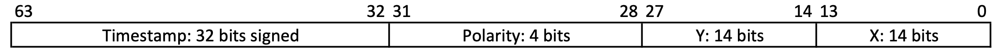
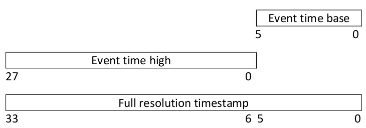
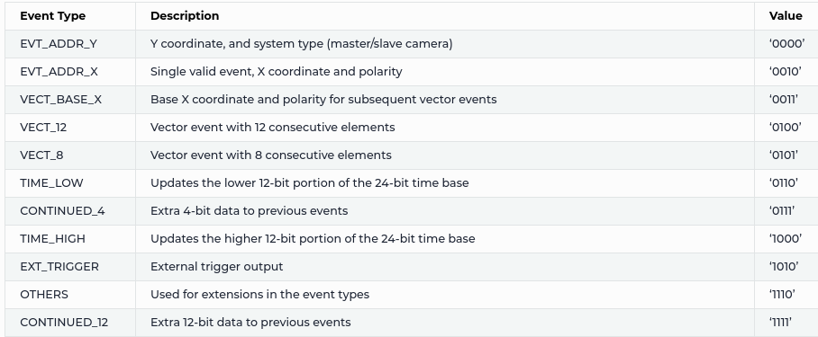
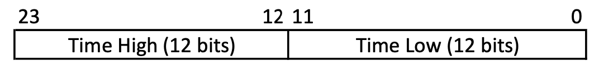

## Data formats for event-based data

In contrast to PNG/JPG for images, there is no standard format for events. When streaming data from an event camera, we get millions of tuples of microsecond timestamps, x/y coordinates and polarity indicators per second that look something like this:

    [(11718661,  762, 147, 1) (11718665,  833, 184, 1)
     (11718669, 1161,  72, 1) (11718674, 1110, 100, 0)
     (11718679, 1073,  23, 1) (11718684, 1134,  56, 1)
     (11718688,  799, 304, 0) (11718691,  391, 289, 0)
     (11718694,  234, 275, 1) (11718699,  512, 335, 1)]


With the emergence of event-based sensors, likewise came numerous ways how to store the data. A straightforward idea is to resort to existing packages such as hdf5 and numpy. When training spiking neural networks, file reading speed is a bottleneck we need to keep in mind. As the spatial resolution of event cameras grows, we receive more and more events per second! Training on bigger datasets means that we want to keep in mind the file reading speed of our data. Here we list the results of our benchmark of different file type encodings and software frameworks that can decode files. 


The file size depends on the encoding, whereas the reading speed depends on the particular implementation of how files are read. In terms of file size, we can see that numpy doesn't use any compression whatsoever, resulting in some 1.7GB file for our sample data. Prophesee's [evt3](https://docs.prophesee.ai/stable/data/encoding_formats/evt3.html) format achieves the best compression by cleverly encoding differences in timestamps. In terms of reading speed, numpy is the fastest as it doesn't deal with any compression on disk. Unzipping the compressed events from disk on the other hand using h5py is by far the slowest. Using [Expelliarmus](https://github.com/open-neuromorphic/expelliarmus) and the [evt2](https://docs.prophesee.ai/stable/data/encoding_formats/evt2.html) file format, we get very close to numpy reading speeds while at the same time only using a fourth of the disk space. This becomes particularly important for larger datasets which can easily reach some 3-4TB when encoded in an inefficient file format. 

## Prophesee encoding formats

[Prophesee](https://prophesee.ai) uses three main encodings for their data: DAT, EVT2 and EV3. 

### DAT



The [DAT](https://docs.prophesee.ai/stable/data/file_formats/dat.html) format encodes an event to a 64 bits word, divided in the following way (following Little Endian (LE) ordering):
* bits 31-0 (**32** bits) are dedicated to the **timestamp**. Hence, each DAT recording can store at most **1 hour and 12 minutes** long.
* bits 45-32 (**14** bits) are allocated for the **x address** of the event.
* bits 59-46 (**14** bits) are allocated for the **y address** of the event.
* bits 63-60 (**4** bits) are dedicated to the **polarity** of the event.

It is evident that the data is not compressed but simply stored in a binary format. One might say that the description does not follow the picture provided in the documentation, but this is the actual format when reading 64 bits at time from the binary file on a LE machine. Check the code [here](https://github.com/open-neuromorphic/expelliarmus/blob/cc9fbf1f53bfccd75c920e37d4ed94aa5aec3b1b/expelliarmus/src/dat.c#L136).

The C++ code needed to decode such an event is the following:

```cpp
/** Function that decodes a DAT event to a (ts, x, y, p) tuple.
 *
 *  @param[in]   buff    64 bits buffer read from the DAT file.
 *  @param[out]  ts      64 bits timestamp.
 *  @param[out]  x       16 bits x address.
 *  @param[out]  y       16 bits y address.
 *  @param[out]  p       8 bit polarity.
 */
void decode_event(
    const uint64_t buff, 
    int64_t& ts, 
    int16_t& x, 
    int16_t& y, 
    uint8_t& p
    ) {
    const uint64_t mask_32b = 0xFFFFFFFF; 
    const uint32_t mask_14b = 0x3FFF; 

    const uint32_t upper_32b = (buff >> 32); // Upper 32 bits.
    const uint32_t lower_32b = (buff & mask_32b); // Lower 32 bits.

    ts = lower_32b; // Timestamp.
    x = upper & mask_14b; // X address.
    y = (upper >> 14) & mask_14b; // Y address
    p = upper >> 28; // Polarity.

    return; 
}
```

### EVT2

Here things get interesting. For [EVT2](https://docs.prophesee.ai/stable/data/encoding_formats/evt2.html), each event is encoded to **32** bits words. In particular, two kinds of events are used: `CD_OFF` and `CD_ON`, respectively associated to events with **negative** and **positive** polarity.

A CD event is structured in the following way: 

```
          4 bits          6 bits      11 bits     11 bits
  ---------------------------------------------------------
 | Event type (on/off) | Timestamp | X address | Y address |
  ---------------------------------------------------------
```

* the first 4 bits are the event type. One might see this as the value of the polarity bit.
* then, 6 bits are dedicated to the timestamp. However, the full resolution time stamp is given by this merged with the **upper 28 bits** passed in another event, called `TIME HIGH`, as it is shown in the following: 



Hence, the **lower 6 bits** are passed during a `CD_*` event, while the **upper 28 bits** are passed during a `TIME HIGH` event, which is structured in the following way: 

```c
       4 bits                    28 bits
  --------------------------------------------------------
 | Time high code |             Timestamp                 |
  --------------------------------------------------------
```

Since the lower 6 bits change **more frequently** than the upper one, many events can be encoded in `CD_*` ones before sending out a new `TIME_HIGH` reference. 

Probably the reader would like to see some code, and here it comes:

```cpp
/** Function that decodes an EVT2 event to a (ts, x, y, p) tuple.
 *
 *  @param[in]   buff    32 bits buffer read from the DAT file.
 *  @param[out]  ts      64 bits timestamp.
 *  @param[out]  x       16 bits x address.
 *  @param[out]  y       16 bits y address.
 *  @param[out]  p       8 bit polarity.
 *
 *  @return      isEvent True when an event has been decoded.
 */
bool decode_event(
    const uint32_t buff, 
    int64_t& ts, 
    int16_t& x, 
    int16_t& y, 
    uint8_t& p
    ) {
    const uint32_t mask_28b = 0xFFFFFFF; 
    const uint32_t mask_11b = 0x7FF; 
    const uint32_t mask_6b = 0x3F; 

    static uint64_t ts_high = 0; // Static so that ts_high value is 
                                 // remembered the next time the 
                                 // function is called.
    bool isEvent = false; 
    
    uint8_t evt_type = buff >> 28; 

    switch (evt_type) {
        case 0x0: // CD_OFF
        case 0x1: // CD_ON
            p = evt_type; 
            ts = (ts_high << 28) | ((buff >> 22) & mask_6b); 
            x = (buff >> 11) & mask_11b; 
            y = buff & mask_11b; 
            isEvent = true;
            break; 

        case 0x8: // TIME_HIGH
            ts_high = buff & mask_28b; 
    }

    return isEvent; 
}
```

The version that actually works is available [here](https://github.com/open-neuromorphic/expelliarmus/blob/cc9fbf1f53bfccd75c920e37d4ed94aa5aec3b1b/expelliarmus/src/evt2.c#L169).

### EVT3

With EVT3, compression is even higher: events are encoded to **16 bits** words, but we have much more event types.



The logic behind EVT3 is the following:  a new event is registered when the **`x` address** changes. From this principle, one has to register an event when one of the following three events appear in the stream:
* `EVT_ADDR_X`: single event with the `x` coordinate encoded to it, together with polarity. The timestamp and `y` address have been passed in previous events. This event is structured as follows:

```
       4 bits         1 bit             11 bits
  --------------------------------------------------------
 | EVT_ADDR_X code | Polarity |        X address          |
  --------------------------------------------------------
```

* `VECTOR_12`: 12 events vectorized in a single data buffer. In particular, starting forom a **base `x` address**, called `baseX`, all the events in this buffer are placed in the next 12 pixels starting from `baseX`:

```
        4 bits         1 bit             11 bits
  --------------------------------------------------------
 | VECT_BASE_X code | Polarity |      Base X address      |
  --------------------------------------------------------
```

The mask vector is encoded in the following way: 

```
       4 bits                     12 bits
  --------------------------------------------------------
 | VECTOR_12 code |            Validity mask              |
  --------------------------------------------------------
```

Not all the events in the vector are valid: only the ones to which a bit equal to 1 in the mask is associated are! For this reason, a validity mask made up of 12 bits is provided: if we see the validity mask as a vector of 12 integers, the code to interpret it is the following:

```cpp
for (int i=0; i<12; i++) {
    if (mask[i] == 1) {
        isEvent = true; 
        x_addr = base_x + i; 
        write_event(x_addr); 
    } else {
        isEvent = false; 
    }
}
```

An example of mask is the following:

```
   4 bits                   12 bits
  --------------------------------------------------------
 | VECTOR | 1 | 0 | 1 | 0 | 0 | 1 | 0 | 1 | 1 | 0 | 1 | 1 |
  --------------------------------------------------------
```

This leads to the following events being encoded to output:

```
              Event associated to mask bit #0
  --------------------------------------------------------
 | Timestamp |   baseX + 0   |  y address  |   polarity   |
  --------------------------------------------------------

              Event associated to mask bit #1
  --------------------------------------------------------
 | Timestamp |   baseX + 1   |  y address  |   polarity   |
  --------------------------------------------------------

              Event associated to mask bit #3
  --------------------------------------------------------
 | Timestamp |   baseX + 3   |  y address  |   polarity   |
  --------------------------------------------------------

              Event associated to mask bit #4
  --------------------------------------------------------
 | Timestamp |   baseX + 4   |  y address  |   polarity   |
  --------------------------------------------------------

              Event associated to mask bit #6
  --------------------------------------------------------
 | Timestamp |   baseX + 6   |  y address  |   polarity   |
  --------------------------------------------------------

              Event associated to mask bit #9
  --------------------------------------------------------
 | Timestamp |   baseX + 9   |  y address  |   polarity   |
  --------------------------------------------------------

              Event associated to mask bit #11
  --------------------------------------------------------
 | Timestamp |   baseX + 11  |  y address  |   polarity   |
  --------------------------------------------------------
```
Since we are dealing with a 12 bit buffer, the code is actually the following: 

```cpp 
for (int i=0; i<12; i++) {
    if (mask & 1) { // Reading the LSB.
        isEvent = true; 
        x_addr = base_x + i; 
    } else {
        isEvent = false; 
    }
    mask = mask >> 1; // Moving on to the next bit.
}
```

* `VECTOR_8`: same as `VECTOR_12` but with 8 events.

What about timestamps? Well, now the timestamp is encoded in a **24 bits** data buffer, separated in two events: `TIME_LOW` for the lower 12 bits, `TIME_HIGH` for the upper 12 bits. Each of these events is encoded as follows:

```
         4 bits                     12 bits
  --------------------------------------------------------
 | TIME HIGH/LOW code |            Timestamp              |
  --------------------------------------------------------
```

Hence, we need to glue together these values to get the full timestamp.




```cpp
/** Function that decodes an EVT3 event to a (ts, x, y, p) tuple.
 *
 *  @param[in]   buff    16 bits buffer read from the DAT file.
 *  @param[out]  ts      64 bits timestamp.
 *  @param[out]  x       16 bits x address.
 *  @param[out]  y       16 bits y address.
 *  @param[out]  p       8 bit polarity.
 *
 *  @return      isEvent True when an event has been decoded.
 */
bool decode_event(
    const uint16_t buff, 
    int64_t ts[12], 
    int16_t x[12], 
    int16_t y[12], 
    uint8_t p[12]
    ) {
    const uint16_t mask_12b = 0xFFF; 
    const uint16_t mask_11b = 0x7FF; 

    static uint64_t tsHigh, tsLow = 0;
    static int16_t yLoc = 0; // To remember the y value across events.
    static int8_t pLoc = 0; // To remember the p value across events.
    static int16_t baseX = 0; // Base x address for vectorized events.
    static int16_t numVectEvts = 0; 

    bool isEvent = false; 

    /** Resetting the polarity array. Our policy is that polarity can be 
     *  either 0 or 1; by setting the elemnts in the polarity vector to 
     *  a number larger than 1, we tell the user that those are non valid 
     *  events.
     */
    int16_t i=0; 
    for (i=0; i<12; i++)
        p[i] = 99; 
    
    uint8_t evt_type = buff >> 12; 

    switch (evt_type) {
        case 0x0: // EVT_ADDR_Y.
            yLoc = buff & mask_11b;  
            break; 
        
        case 0x2: // EVT_ADDR_X.
            ts[0] = (tsHigh << 12) | tsLow; 
            x[0] = buff & mask_11b; 
            y[0] = yLoc; 
            p[0] = (buff >> 11) & 1; 
            isEvent = true; 
            break; 

        case 0x3: // EVT_BASE_X.
            baseX = buff & mask_11b; 
            pLoc = (buff >> 11) & 1; 
            break; 

        case 0x4: // VECT_12.
            numVectEvts = 12; 
        case 0x5: // VECT_8; 
            if (numVectEvts == 0)
                numVectEvts =  8;
            int16_t mask = buff & mask_12b; 
            for (i=0; i<numVectEvts; i++) {
                if (mask & 1){
                    ts[i] = (tsHigh << 28) | tsLow; 
                    x[i] = baseX + i; 
                    y[i] = yLoc; 
                    p[i] = pLoc; 
                    isEvent = true; 
                }
                mask = mask >> 1; 
            }
            numVectEvts = 0; 
            break; 

        case 0x6: // TIME_LOW.
            tsLow = buff & mask_12b; 
            break; 
        
        case 0x8: // TIME_HIGH.
            tsHigh = buff & mask_12b; 
            break; 
    }

    return isEvent; 
}
```

This code is just for demonstration purposes, it won't actually work, since we need to take care of other things such as timestamp overflows. A working version of this code is provided [here](https://github.com/open-neuromorphic/expelliarmus/blob/cc9fbf1f53bfccd75c920e37d4ed94aa5aec3b1b/expelliarmus/src/evt3.c#L256).

## Authors
* [Gregor Lenz](https://lenzgregor.com) [to be continued by @Gregor].
* [Fabrizio Ottati](https://fabrizio-ottati.dev) is a Ph.D. student in the HLS Laboratory of the Department of Electronics and Communications, Politecnico di Torino. His main interests are event-based cameras, digital hardware design and neuromorphic computing. He is one of the maintainers of two open source projects in the field of neuromorphic computing, [Tonic](https://tonic.readthedocs.io) and [Expelliarmus](https://expelliarmus.readthedocs.io), and one of the founders of [Open Neuromorphic](https://open-neuromorphic.org).

## Bibliography

* [Prophesee documentation](https://docs.prophesee.ai/stable/data/file_formats/index.html) on file and event formats.
* [Expelliarmus](https://expelliarmus.readthedocs.io) source code.
