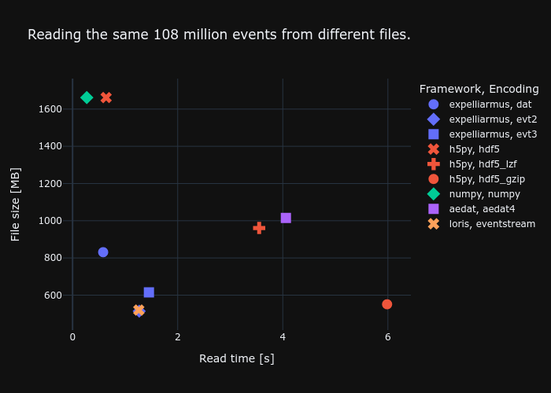

In contrast to png/jpg for images, there is no standard format for events. When streaming data from an event camera, we get tuples of (time,x,y,polarity) that look something like this:

    [(11718661,  762, 147, 1) (11718665,  833, 184, 1)
     (11718669, 1161,  72, 1) (11718674, 1110, 100, 0)
     (11718679, 1073,  23, 1) (11718684, 1134,  56, 1)
     (11718688,  799, 304, 0) (11718691,  391, 289, 0)
     (11718694,  234, 275, 1) (11718699,  512, 335, 1)]

With the emergence of event-based sensors, likewise came numerous ways of how to store the data. Some of the better ideas are hdf5 and numpy, some of the worse ones text files. When training spiking neural networks, file reading speed is a bottleneck we need to keep in mind. As the spatial resolution of event cameras grows, we receive more events for the same signal. Training on bigger datasets means that we want to keep in mind the file reading speed of our data. Here we list the results of our benchmark of different file type encodings and software frameworks that can decode files. 

The file size depends on the encoding, whereas the reading speed depends on the particular implementation of how files are read. In terms of file size, we can see that numpy doesn't use any compression whatsoever, resulting in some 1.7GB file for our events. Prophesee's [evt3](https://docs.prophesee.ai/stable/data/encoding_formats/evt3.html) format achieves the best compression by cleverly encoding differences in timestamps. In terms of reading speed, numpy is the fastest as it doesn't deal with any compression on disk. Unzipping the events from disk on the other hand using h5py is by far the slowest. Using [Expelliarmus](https://github.com/open-neuromorphic/expelliarmus) and the [evt2](https://docs.prophesee.ai/stable/data/encoding_formats/evt2.html) file format, we get very close to numpy reading speeds while at the same time only using a fourth of the disk space. This becomes particularly important for larger datasets which can easily reach some 3-4TB because of inefficient file encodings. 
