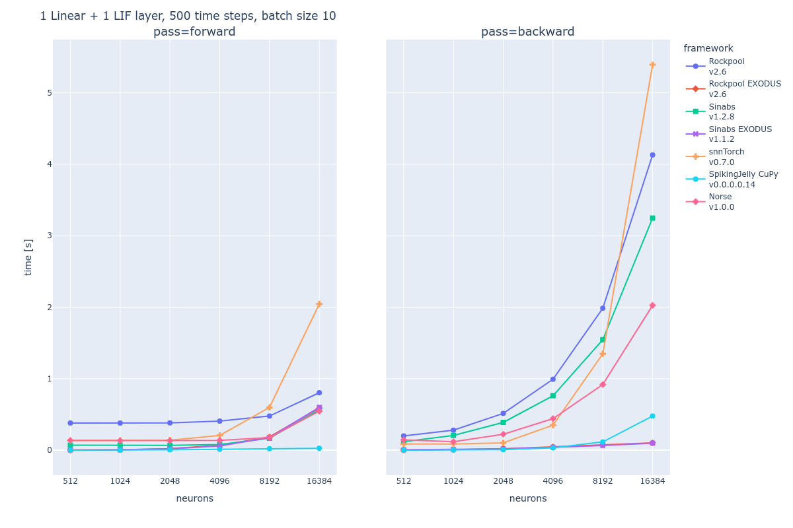

# Comparison of SNN frameworks based on PyTorch

Open Neuromorphic's [list of SNN frameworks](https://github.com/open-neuromorphic/open-neuromorphic) currently counts 10 libraries, and those are only the most popular ones! As the sizes of spiking neural network models grow thanks to deep learning, optimization becomes more important for researchers and practitioners alike. Training SNNs is often slow, because being a stateful network, it relies on sequential inputs. Today's most popular training method then is some form of backpropagation through time, whose time complexity scales linearly with the number of time steps. We benchmark libraries that all take slightly different approaches on how to extend PyTorch for gradient-based optimization of SNNs. While we focus on the time it takes to pass data forward and backward through the network, there are obviously other, non-tangible qualities of frameworks (extensibility, quality of documentation, ease of install, support for neuromorphic hardware ...) that we're not going to try to capture here. 

The figure shows average times across 100 runs for forward and backward passes in different frameworks. Standard deviations have been omitted because they are negligible. The input data has batch size of 10, 500 time steps and $n$ neurons. The order of dimensions in the input tensor and how exactly it is fed to the respective models differs from library to library. The libraries that use an implementation of EXODUS benefit from CUDA code and vectorization across the time dimension in both forward and backward passes, which makes them incredibly fast. 