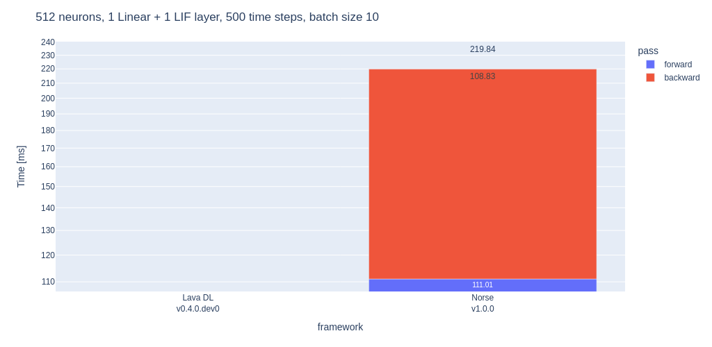
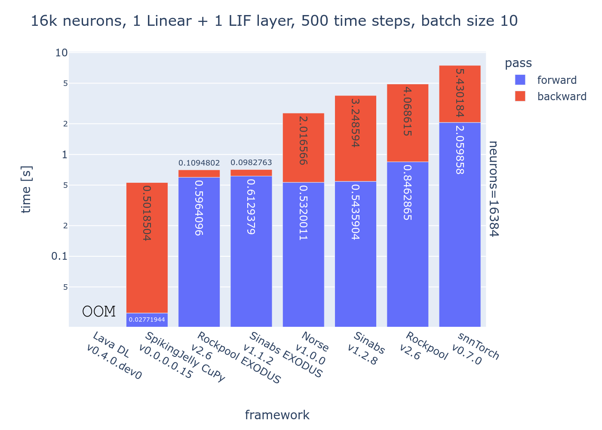

# SNN library benchmarks

Open Neuromorphic's [list of SNN frameworks](https://github.com/open-neuromorphic/open-neuromorphic) currently counts 10 libraries, and those are only the most popular ones! As the sizes of spiking neural network models grow thanks to deep learning, optimization becomes more important for researchers and practitioners alike. Training SNNs is often slow, as the stateful networks are typically fed sequential inputs. Today's most popular training method then is some form of backpropagation through time, whose time complexity scales with the number of time steps. We benchmark libraries that all take slightly different approaches on how to extend PyTorch for gradient-based optimization of SNNs. While we focus on the time it takes to pass data forward and backward through the network, there are obviously other, non-tangible qualities of frameworks (extensibility, quality of documentation, ease of install, support for neuromorphic hardware ...) that we're not going to try to capture here. In our benchmarks, we use a single fully-connected (linear) and a leaky integrate and fire (LIF) layer. The input data has batch size of 10, 500 time steps and n neurons. 

The first figure shows results for a small 512 neuron network. Standard deviations have been omitted because they are negligible.  Overall, SpikingJelly is the fastest when using the CuPy backend, at just 1.5ms for both forward and backward call. The libraries that use an implementation of [EXODUS](https://www.frontiersin.org/articles/10.3389/fnins.2023.1110444/full) (Sinabs / Rockpool) or [SLAYER](https://proceedings.neurips.cc/paper_files/paper/2018/hash/82f2b308c3b01637c607ce05f52a2fed-Abstract.html) (Lava DL) equally benefit from custom CUDA code and vectorization across the time dimension in both forward and backward passes. It is noteworthy that such custom implementations exist for specific neuron models (such as the LIF under test), but not for arbitrary neuron models. Flexibility comes at a price, which is what frameworks such as snnTorch, Norse, Sinabs or Rockpool make use of. SpikingJelly also supports a conventional PyTorch GPU backend with which it's possible to define neuron models more flexibly. Such implementations are also much easier to maintain and relying on the extensive testing of PyTorch means that it will likely work on a given machine configuration. Custom CUDA/CuPy backend implementations need to be compiled and then it is up to the maintainer to test it on different systems. On top of that, networks that are implemented in SLAYER, EXODUS or SpikingJelly with a CuPy backend cannot be executed on a CPU (unless converted). 

When scaling up the number of neurons, the difference between performances becomes more evident. We notice that snnTorch has issues scaling up the forward and backward pass, and Lava DL goes out of memory (OOM) completely, potentially because of the use of conv3d kernels. SpikingJelly keeps its blazing fast forward pass, and EXODUS implementations have the quickest backward pass. SpikingJelly is more than 10 times faster than libraries that rely on pure PyTorch acceleration. 

## Summary
The ideal library will often depend on a multitude of factors, such as accessible documentation, usability of the API or pre-trained models. Generally speaking, PyTorch offers good support when custom neuron models (that have additional states, recurrence) are to be explored. For larger networks, it will likely pay off to rely on CUDA-accelerated existing implementations or [implement CuPy backends](https://spikingjelly.readthedocs.io/zh_CN/latest/activation_based_en/cupy_neuron.html) for new neuron models. Yet another option is to experiment with torch.compile or CUDA graph replay, although that has not been tested here. 

## Code
The code for this benchmark is available [here](https://github.com/open-neuromorphic/open-neuromorphic.github.io/blob/main/content/post/framework-benchmarking/data-generation.ipynb). The order of dimensions in the input tensor and how it is fed to the respective models differs between libraries. Benchmarks are averaged across 100 runs on a NVIDIA RTX 2070 GPU with 8GB of memory. Some things that would be interesting to add:

* effect of torch.compile on networks
* effect of CUDA graph replay
* memory consumption of different libraries
* benchmarking JAX implementations

## Author
* [Gregor Lenz](https://lenzgregor.com) holds a PhD in neuromorphic engineering from Sorbonne University and has been training SNNs for a little while now!
